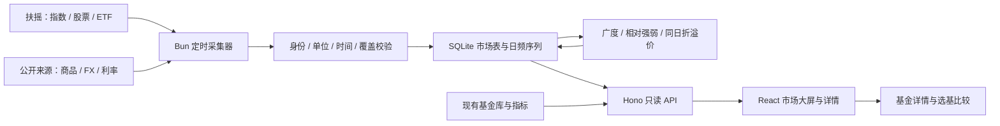

# 13 · 宏观大屏与跨资产数据调研

> 调研日期：2026-09-06（周日，Asia/Shanghai）。基于 Fundly v0.4.0、扶摇在线文档、Financial-API 仓库契约与实际授权请求。
>
> 本文记录前期数据验证、产品方案与离线原型。后续已完成采集器、市场表与 Basalt / K 线页面，代码随 `v0.5.0` 部署；生产数据需单独采集或同步。实现和运行说明见 [14 · 宏观大屏实现](./14-MACRO-IMPLEMENTATION.md)。

## 结论

**可以把 Fundly 扩展为「A 股为中心、跨资产提供环境信息」的宏观大屏，并建立市场 → 行业 → ETF / 基金的下钻路径。** 第一版所需的主要数据已经找到：扶摇覆盖沪深指数、行业指数、股票广度和 ETF；上期所、ECB、中国货币网、FRED、Cboe 补充商品、汇率、利率和海外风险指标。

建议先做完整的当日 / 最近交易日总览，再在交易时段验证扶摇快照延迟，决定盘中刷新频率。周日取数无法证明实时性；公开跨资产来源也有不同的发布节奏，不能给整块大屏统一标上「实时」。

| 用户目标 | 可行性 | 关键边界 |
|---|---|---|
| 沪深大盘、市场广度 | 可进入首版 | 指数快照、日线、全市场股票快照和涨跌停池均已取到；盘中时效待验证 |
| 行业强弱与下钻 | 可进入首版 | 行业目录、指数日线、当前成分可用；目录混合层级，需整理比较域 |
| ETF | 可进入首版 | 宽基、行业、跨境、黄金、国债 ETF 快照样本均成功；历史日线和披露信息有验证样本 |
| 其他场内基金 | 分类型接入 | LOF 快照与资料成功，LOF 历史不支持；REITs 样本未打通 |
| 商品、汇率、利率 | 可做日频环境面板 | 已取得官方 / 公开数据；需显示合约、单位、观察日期与发布滞后 |
| 分钟图、完整资金流、实时行业暴露 | 当前证据不足 | 没有已确认可用的分钟 / tick、ETF 净申购流、IOPV、历史指数权重等能力 |

## 交付物与复现

参考仓库已 clone 到 `/Users/nocoo/workspace/personal/reference/Financial-API`，工作树干净。检视版本为 `765513c2616030803ad80915ed65b205f425a942`（2026-08-27）。

本机研究产物位于 `output/macro-research-2026-09-06/`。该目录被 Git 忽略，原始响应和截图不随仓库提交；本报告保存结论与来源。

| 产物 | 内容 |
|---|---|
| [交互大屏](../output/macro-research-2026-09-06/macro-dashboard.html) | 单文件 HTML，内嵌真实响应整理的数据，浏览器直接打开，无运行时网络请求 |
| [1920×1080 截图](../output/macro-research-2026-09-06/macro-dashboard-1920x1080.png) | 完整一屏的桌面布局 |
| [ETF 详情截图](../output/macro-research-2026-09-06/etf-detail-1920x1080.png) | 行情、日线、同日净值和披露持仓 |
| [移动端截图](../output/macro-research-2026-09-06/macro-dashboard-mobile.png) | 390px 宽度的纵向浏览 |
| [API 验证清单](../output/macro-research-2026-09-06/api-probes.json) | 请求地址、参数、业务码、行数、采集时间及公开来源回执 |
| [归一化数据](../output/macro-research-2026-09-06/dashboard-data.json) | 指数、广度、行业成分、ETF 与跨资产观察值 |
| [浏览器检查结果](../output/macro-research-2026-09-06/browser-verification.json) | 交互、屏幕适配、离线运行与错误检查 |

原型包含 7 个大盘指数、7 个行业样本、8 只 ETF 和 12 张跨资产卡片。行业可切换 20 / 60 交易日走势，查看成交额前五成分；ETF 与宏观卡片可继续打开详情。它展示产品结构与数据口径，未接入现网路由。

在项目根目录从已保存响应重建，**不再次请求 API**：

```bash
python3 output/macro-research-2026-09-06/build_data.py
python3 output/macro-research-2026-09-06/build_dashboard.py
open output/macro-research-2026-09-06/macro-dashboard.html
```

这里的 Python 仅用于一次性研究产物整理，不是生产运行时依赖。研究阶段的临时凭据已删除；后续实现将授权测试 Key 保存在 Git 忽略、权限 600 的根 `.env`，仅供服务端读取。Key 未写入源码、文档、响应或前端产物。

## Fundly 当前基础

当前生产链路是 **Bun 采集 → SQLite → 派生指标 → Bun / Hono 只读查询 → React**。前端使用 Vite、React 19、Tailwind、Basalt、SWR、Recharts；生产部署为 Railway 单服务加 Volume。`apps/worker/` 名称沿用旧结构，实际服务入口为 [app.ts](../apps/worker/scripts/app.ts)，不应据目录名恢复 Cloudflare / D1 方案。

已有基金浏览、收益与风险比较、4433、持有体验、定投、成本和精选，可作为宏观下钻后的基金研究层。新增市场数据宜沿用现有运行时、认证和只读 API，独立建立市场数据表及指标计算。

本机库检视到 27,527 只基金、30,690,680 条净值记录，schema 版本 3，文件约 4.02 GB。净值最新日期为 **2026-08-20**，货币基金收益数据为 08-21。这是本机快照情况，不能据此推断线上库时效。尤其不能把该库旧净值与新 ETF 市价直接相除计算折溢价。

## Financial-API 与 skills

[Financial-API](https://github.com/HiThink-Tech/Financial-API) 提供 REST / MCP 的接入资料、Node CLI、Python toolkit / SDK、本地 DuckDB 工具、skills 和示例。托管数据服务运行在扶摇，clone 仓库不会得到可自行部署的完整行情后台。

已按其 `AGENTS.md` 阅读统一 skill、REST 接入说明、指数和基金相关契约，并检视 CLI skills 与行业轮动 / 市场热度示例。

| 入口 | 调研所得 | 在 Fundly 中的用途 |
|---|---|---|
| `skills/hithink-finance/SKILL.md` | 统一选择 REST、CLI、MCP 或 Python；先解析标的，再按资产类型路由 | 作为接入与取数纪律参考 |
| `hithink-finance-cli/skills/` | 10 个 skill：shared、symbol、market、index、fund、financials、valuation、special-data、data、research | 按主题发现能力，无需全部安装 |
| index / market / special-data | 指数目录、当前成分、快照、日线、交易日与市场状态池 | 大盘、行业、市场广度 |
| fund | 资料、披露持仓、净值、收益、ETF / LOF 行情等 | 场内基金详情，补充现有基金研究 |
| research / data | 组织取数、缓存、校验和导出 | 借鉴数据溯源与覆盖率检查 |
| 行业强弱轮动、市场热度示例 | 演示指数 → 成分 → 行情的组织方式 | 借鉴交互和指标分组；示例页数据本身不作为证据 |

**生产接入推荐 Bun 原生 `fetch` 调 REST。** Fundly 已有 TypeScript、SQLite 和指标体系，现阶段不需要把 CLI、Python 或 DuckDB 作为服务依赖。skills 的主要价值在于能力发现、参数约束与数据解释。

REST 基址为 `https://fuyao.aicubes.cn`，认证头为 `X-api-key`，服务端凭据来源建议使用 `HITHINK_FINANCE_API_KEY`。HTTP 200 后仍须检查 `code === 0`，并校验 `data.item` 结构、数量、日期和单位。`null` 保持缺失，不能替换成 0。

仓库说明不设置累计调用次数上限，但会动态限流；本次没有确认固定 QPS、生产 SLA 或全部数据的展示 / 再分发条件。MIT 许可针对仓库代码，不能直接推导为所有底层金融数据的使用许可。

## 扶摇 API 实测

共完成 **62 个参数化探测案例、64 次 HTTP 请求，覆盖 18 个不同端点**。其中 57 个案例业务码为 0；两次行业配置错误各进行了单次重试。这里是能力抽样，不能把成功比例解释为服务可用性统计。

### 能力与覆盖

| 能力 | 主要端点 | 本次结果与边界 |
|---|---|---|
| 标的识别 | `/api/meta/tickers/search`、`/list` | A 股 5,567、指数 2,140、ETF 1,670、LOF 404 条目录记录；目录数量不等于行情逐一验证数量 |
| 行业 / 概念目录 | `/api/a-share-index/catalog/ths-index-list` | `industry` 返回 320 条，`cn_concept` 返回 390 条 |
| 交易日 | `/api/a-share/calendar/trading-days` | 成功，用于交易日与闭市状态判断 |
| 指数 / 行业行情 | `/api/a-share-index/prices/snapshot` | 7 个主要指数与 7 个行业快照成功；必须显式传 `thscodes`，不支持省略代码查全量 |
| 指数 / 行业日线 | `/api/a-share-index/prices/historical` | 沪深300与 7 个行业各取得 69 条日线，2026-06-01 至 09-04；契约只支持 `1d`，单请求窗口最多 10 年，未验证完整十年覆盖 |
| 当前指数成分 | `/api/a-share-index/constituents/ths-stock-list` | 沪深300返回 300 只；半导体等 7 行业成功；没有历史成分或权重序列 |
| 股票全市场快照 | `/api/a-share/prices/snapshot` | 六页取回 5,567 只，代码去重后与目录集合完全一致；可本地计算广度 |
| 涨停 / 跌停 / 炸板 | `/api/a-share/special-data/limit-up-pool` 等三个池 | 09-04 日期样本成功，沪深过滤后为 38 / 9 / 48 只 |
| ETF 快照 | `/api/fund/market/snapshot` | 510300、588000、512480、512800、513100、518880、511010、159915 均成功；单请求单只 |
| ETF 历史日线 | `/api/fund/market/historical` | 510300取得 69 条日线；契约只支持 `1d`，单请求最多 5 年；无复权参数 |
| LOF | 同上及 `/api/fund/profile/detail` | 161725.SZ 快照与资料成功；历史返回 `3004` |
| 基金披露和收益 | `/api/fund/portfolio/holdings`、`/performance/nav`、`/performance/returns` | 510300的前十持仓、月内净值、区间收益成功；512480的前十持仓和资料成功 |
| ETF 行业配置 | `/api/fund/portfolio/industry-allocation` | 510300与512480均返回 `5003`，上游状态 `9999`，各重试一次仍失败 |
| REITs | 标的识别、基金资料与行情端点 | 180101.SZ 被元数据标作 `fund-otc`；`fund_type=reits` 资料返回 `1004`，行情返回 `3004`，该路径未打通 |

### 需要保留的差异

在线文档仍有「场内行情仅 ETF」的描述，但本次仓库契约已写明支持 ETF / LOF，LOF 快照也实测成功。历史端点仍仅 ETF，不能从快照能力推断 LOF 历史可用。接入时应记录所依据的契约版本，并以线上回执校验。

行业目录为平面列表，320 条中有 90 条 `881...`、230 条 `884...`，混合了不同层级。**不能把 320 条都排成同一层级的行业排行榜，也不能相加其成交额作为全市场总量。** 首版应整理并明确一套同级行业集合；原型七个板块只是下钻样本。

查到 `USDCNY` 元数据不代表存在可用的 FX 行情端点。当前公开能力没有已确认可用的商品 / FX / 海外综合行情、经济统计数据、分钟 / tick 历史、ETF 净申购序列或 IOPV；也没有可靠的通用「行业 → ETF」对应关系。

### 时间戳与披露期

09-06 周日请求的市场快照带当天 `data.timestamp`，而已核对的沪深300与510300快照价格分别等于09-04日线收盘。部分基金持仓 / 收益响应的顶层时间戳为 0。契约中的「数据就绪时间」不能直接当成每条行情的成交时间。

应分别保存采集时间、提供方原始时间戳、经验证的行情时间 / 交易日、报告期与公告日。无法确定行情时间时保留未知，闭市样本可以标明「最近交易日参考」，同时记录交易日是否推断所得。

两个 ETF 的前十持仓均有 **2026-06-30 报告期、2026-07-21 公告日**。它们是披露持仓，不能据此计算完整实时仓位、行业暴露或当日指数贡献。

### 原型中的沪深广度

股票快照与目录按代码连接后，仅保留交易所为 SH / SZ 的 A 股，共 5,222 只。有效池要求最新价、昨收、成交量、涨跌幅、成交额均为有限数值，最新价和昨收大于 0、成交量大于 0、成交额非负。

| 指标 | 实测值 |
|---|---:|
| 有效股票 / 沪深目录 | 5,207 / 5,222 |
| 上涨 / 下跌 / 平盘 | 2,249 / 2,773 / 185 |
| 有效池涨跌幅中位数 | −0.204638% |
| 有效池成交额合计 | 2,030,440,648,475.7 元，约 2.03 万亿 |
| 涨停 / 跌停 / 炸板池 | 38 / 9 / 48 |

成交额是有效股票池合计，不宣称等同于交易所官方全市场口径。六页数据在闭市后跨数分钟采集，并非同一时点的原子快照；盘中接入需另外处理批次覆盖和时间跨度。

## 商品、汇率和利率的公开来源

以下列出**本次真实取到的数据日期**。公开下载文件不等于有固定 SLA 的正式 API，页面 JSON 与未文档化接口需要独立适配及字段校验。

| 来源 | 本次取到的数据 | 本次最新观察日期 | 建议 |
|---|---|---|---|
| [上期所日行情文件](https://www.shfe.com.cn/data/tradedata/future/dailydata/kx20260904.dat) | 332 行（含汇总）；黄金、白银、铜、螺纹钢等逐合约价量、结算与持仓 | 09-04，文件更新 15:30:04 | 国内商品日频主源，按明确合约和价格口径展示 |
| [ECB Data API](https://data.ecb.europa.eu/help/api/overview) | USD、CNY、JPY 的欧元基准日汇率；可同日交叉换算 | 09-04 | 官方日度参考 FX 主源，不用于盘口或盘中 CNY / CNH 价差 |
| [Frankfurter v2](https://frankfurter.dev/) | 多币种参考汇率与历史；指定 ECB 的 USD/CNY/EUR/JPY/GBP 查询成功 | 09-04 | 便捷接入 / 对照入口；固定 `providers`，与 ECB 同源时不算独立行情源 |
| [FRED 公开 CSV](https://fred.stlouisfed.org/) | 美国国债 DGS10 / DGS2：4.77% / 4.34% | 09-03 | 日度利率，变化用 bp；同日10Y−2Y为43 bp |
| [FRED / EIA WTI](https://fred.stlouisfed.org/series/DCOILWTICO)、[Brent](https://fred.stlouisfed.org/series/DCOILBRENTEU) | 91.48 / 96.02 美元/桶 | 09-01 | 有滞后的日度现货，只作为环境参考 |
| [FRED 广义美元指数](https://fred.stlouisfed.org/series/DTWEXBGS) | 118.7479 | 08-28 | 贸易加权美元指标，不能标成 ICE DXY |
| [FRED 标普500](https://fred.stlouisfed.org/series/SP500)、[纳斯达克综合](https://fred.stlouisfed.org/series/NASDAQCOM) | 7,718.60 / 26,506.99 | 09-04 美国交易日 | 海外收盘参考；分别保留指数身份与当地日期 |
| [Cboe VIX CSV](https://cdn.cboe.com/api/global/us_indices/daily_prices/VIX_History.csv) | VIX 收盘14.53 | 09-04 美国交易日 | 波动环境主源，本次比 FRED 对应数据更新 |
| [中国货币网 Shibor](https://www.chinamoney.com.cn/r/cms/www/chinamoney/data/shibor/shibor.json) | 八个期限；1W 为1.3760%，较前次+0.20 bp | 09-04 11:00 | 国内流动性参考，Shibor 不等于 DR007 |
| [中国货币网 LPR](https://www.chinamoney.com.cn/r/cms/www/chinamoney/data/currency/bk-lpr.json) | 1Y 为3.00%，5Y 为3.50% | 08-20（月度） | 政策 / 信贷背景，按月度发布周期判断时效 |

### 可复用的请求形式

```text
上期所逐日文件
https://www.shfe.com.cn/data/tradedata/future/dailydata/kx20260904.dat

ECB，同一欧元基准，SDMX CSV
https://data-api.ecb.europa.eu/service/data/EXR/D.USD+CNY+JPY.EUR.SP00.A?startPeriod=2026-08-01&format=csvdata

Frankfurter v2，固定提供方
https://api.frankfurter.dev/v2/rates?base=USD&quotes=CNY,EUR,JPY,GBP&providers=ECB&from=2026-08-01&to=2026-09-06

FRED 单序列公开图表 CSV
https://fred.stlouisfed.org/graph/fredgraph.csv?id=DGS10&cosd=2026-08-01
```

FRED 的公开图表下载本次无需 Key，正式 FRED API 的认证要求是另一回事。多序列、混合频率下载可能返回 ZIP 而非单个 CSV，应检视 Content-Type / 文件签名；首版按单序列请求更简单。Frankfurter 无需 Key，但公共端点仍有限流；默认组合多个央行来源，不能静默改变提供方。

本次 Frankfurter 还取到 USD/CNH 的09-04参考值6.7125；展开提供方后存在不同源日期。不要将它与 ECB CNY 直接做「同一时点在岸 / 离岸压力」指标。ECB 交叉换算示例为 `CNY_per_EUR / USD_per_EUR`，结果是每美元对应人民币。

### 商品的展示口径

原型选09-04持仓量最大的黄金 / 铜合约：AU2610收盘965.96元/克，昨结算952.06，当日结算970.82；CU2610收盘108,780元/吨，昨结算108,540。卡片涨跌为 `收盘 / 昨结算 − 1`，详情分别显示收盘与结算。

这只是**该日观察合约**，不能把每天换成持仓量最大的合约后直接拼成连续收益。历史商品视图需要固定合约序列或明确的换月规则，并保留期限、计价币种和单位。期货、现货、黄金 ETF、黄金股行业指数代表不同敞口，应该分开命名。

### 试验性补充与未验证范围

新浪 `hq.sinajs.cn` 配合财经页 Referer、GB18030 解码，已取得部分国内期货连续代码、外盘黄金 / 铜 / 油、USD/CNY、USD/CNH、恒指与恒生科技数据；夜盘日期可能跨自然日。`hf_DINI` 返回空，部分 `int_*` 全球指数没有时间戳，且与较新的参考源明显不一致，不宜作主源。

Yahoo chart 的 `GC=F` 日线在一次 TLS 失败后重试成功，取得23条期货日线。这类未正式承诺的公共行情路由可作实验对照，不能据一次成功承诺长期稳定或实时性。本次 Frankfurter、首次 clone 也出现过短暂 TLS 问题，后续需要在实际部署环境复测连接稳定性。

中国 GDP、CPI / PPI、PMI、M2、社融、DR007、中国10年国债收益率应进入后续宏观模块；国家统计局、人民银行、中国货币网 / 中债是候选官方来源，**本次尚未验证对应取数接口**。

## 产品设计：一横一纵

以下保留研究阶段的产品范围与接入设计；当前已实现范围和未覆盖项以文档 14 为准。

### 横向：一屏回答市场环境问题

默认以 A 股为中心。大屏优先显示市场广度、行业强弱、流动性与跨资产环境，个股短线热榜留作可选详情。

| 区域 | 应回答的问题 | 首版内容 |
|---|---|---|
| 顶部指数带 | 大盘方向、大小盘与成长风格是否一致 | 上证、深证、沪深300、创业板、中证500、中证1000、科创50；涨跌与交易状态 |
| 市场广度 | 指数的变化有多少股票参与 | 上涨 / 下跌 / 平盘、有效覆盖、中位涨跌、有效池成交额、涨跌停家数 |
| 行业观察 | 强弱集中在哪些领域、是否持续 | 经整理的同级行业热力图，日涨跌、20 / 60日相对沪深300走势 |
| 联动详情 | 当前关注的领域内部怎样 | 选中行业后展示走势、成分分布、成交活跃成分和相关ETF |
| 跨资产环境 | 汇率、商品、利率、海外风险怎样变化 | 美元/人民币、美元/日元、国内金铜合约、原油现货、美债、Shibor、VIX、海外收盘 |
| 产品观察池 | 哪些工具代表这些市场方向 | 宽基、行业、跨境、黄金、债券ETF；价格、涨跌、成交额 |
| 数据状态 | 这些信息属于哪个时点 | 每张卡的交易日 / 观察日、闭市 / 延迟 / 最近公布状态；详情中的来源与统计口径 |

在1920×1080下完整一屏，主数字清晰可扫读。悬停解释涨跌基准，点击保留行业和窗口上下文。进入全屏后收起应用导航，保存观察池与颜色偏好；前端继续使用现有涨跌配色设置。移动端按市场、行业、资产、ETF顺序纵向浏览。

首版不需要统一的「牛熊总分」。可以生成可追溯的事实摘要，例如本样本中沪深300跌0.10%、中证500跌1.32%、5,207只有效股票中2,249只上涨；将相对强弱和参与广度直接呈现给用户。宏观卡片的红绿只表达数值方向，不能把美元上涨、利率上涨和股票上涨都解释为同一风险信号。

### 纵向：同一套导航深入领域

| 入口 | 下钻内容 | 与已有功能的连接 |
|---|---|---|
| 指数 | 日线、多窗口涨跌、当前成分及其涨跌分布 | 相关宽基ETF与基金；缺少权重时不显示「指数贡献点数」 |
| 行业 | 行业相对基准走势、成分广度、成交活跃成分、相关ETF | 经核实的主题基金集合可进入现有收益 / 风险 / 成本比较 |
| ETF / LOF | 场内价格、价量、披露资料、独立日期的净值、费率与持仓 | 通过明确的基金身份映射进入现有基金详情；LOF缺历史时不补假曲线 |
| 商品 | 固定合约日线、到期月份、成交与持仓、结算；后续扩展期限结构 | 黄金 / 商品ETF作为另一种敞口单独关联，说明标的差异 |
| 汇率 | 同一提供方的日频走势、多窗口变化、币种单位 | 将本币计价与外币计价表现分开，跨币种换算须对齐日期 |
| 利率 / 宏观 | Shibor各期限、美债期限利差、LPR最近发布；后续加经济统计 | 显示观察期、发布时间与修订记录，辅助理解股票和基金环境 |

建议增加「市场」导航分组：`/market`、`/market/industries`、`/market/etfs`、`/market/commodities`、`/market/fx`、`/market/rates`，详情采用带资产身份的路由。大屏模式可以是 `/market?display=wall`。从行业进入ETF再进入 `/funds/:code` 时，保留返回来源与比较窗口，复用当前导航 / 列表来源机制。

**行业 → ETF → 基金的关系需要显式建模。** 优先使用经过核实的跟踪指数；其次是人工维护的主题关系。披露持仓只能形成「截至某报告期的部分暴露」，不能用前十大股票代表完整配置。原型中的半导体 → 512480、贵金属 → 518880均按主题关联处理，尤其黄金ETF不等于黄金股指数。

## 专业指标与时间规则

| 指标 | 口径 |
|---|---|
| 股票 / ETF当日涨跌 | 使用源字段并校验其与昨收的关系；价格和币种不能混淆 |
| 20 / 60交易日价格涨跌 | `P[t] / P[t−N] − 1`，需要N+1个有效收盘点，不能用20条价格冒充20个收益区间 |
| 行业相对强弱 | 相同起止日期的行业价格涨跌减沪深300价格涨跌，以百分点 `pp` 表示 |
| ETF投资回报 | 市场价日线、单位净值、分红再投资总回报分开建模；无复权ETF收盘价不能直接沿用基金总回报排名 |
| ETF收盘折溢价 | 仅在基金身份和交易日一致且净值有效时，计算 `收盘价 / 单位净值 − 1` |
| 盘中折溢价 | 需要明确时点的IOPV等数据；不能使用没有净值日期的资料字段冒充 |
| 市场广度 | 同一交易所范围、同一有效池，公布分母；可交易性 / 停牌状态不足时准确标作有效行情覆盖 |
| 成交额 | 代表交易活跃度，不能当净流入；重叠指数和多层级行业不能直接加总 |
| 利率变化 | 4.79%→4.77%是−2 bp；10Y−2Y利差须对齐观察日 |
| 商品涨跌 | 明确收盘对昨收，或收盘对昨结算；固定合约与连续合约的收益不能混用 |
| FX变化 | 明确基准币 / 报价币和提供方；参考汇率与盘中成交价分开；CNY / CNH比较需时间可比 |
| 时间序列缺口 | 保持缺失，不补0；跨市场比较先对齐可用日期，不静默拿各自最新值算相关性 |

本次510300的09-04收盘价为4.616，同日单位净值为4.6147，因此可计算收盘溢价约 **0.02817%**。该样本在原型中展示；其他ETF未校验同日净值时留空。

每条记录至少区分以下时间，不用单个 `updated_at` 承载全部语义：

| 字段 | 含义 |
|---|---|
| `collected_at` | Fundly收到数据的时间 |
| `provider_timestamp` | 上游原始时间戳，未知 / 0值不擅自解释 |
| `quote_at`、`trade_date` | 经验证的行情时间与交易日；另记是否由交易日历推断 |
| `observation_date`、`period_end` | 经济指标 / 汇率观察日，或季度持仓等报告期末 |
| `published_at` | 对外公布时间，与观察期分开 |
| `batch_id`、`batch_started_at`、`batch_finished_at` | 分页快照所属批次与采集跨度 |

状态判断按各来源交易日历、时区与发布时间规则执行。休市期间保留最近收盘值并显示「休市」；接口失败保留最近成功值并显示其旧日期；尚无数据才为空。月度LPR与日频行情采用不同过期规则。商品夜盘使用交易所归属交易日，海外收盘保留当地交易日；历史研究只能使用当时已公开的信息。

## 与现有工程的接入方案



### 数据模型

首版建议沿用SQLite，新增独立市场表。以下为逻辑表建议，正式DDL需另行设计迁移，不能直接假定现有表已具备这些字段。

| 表 / 关系 | 主要作用 |
|---|---|
| `market_instrument` | 内部标的ID、资产类型、交易所、币种、单位、交易日历与有效状态 |
| `market_symbol_alias` | 提供方代码映射；保留 `thscode`、原始 `ticker`，记录已核实的现有 `fund_code` 关联 |
| `market_quote_latest` | 每来源 / 标的 / 价格口径的最近有效快照及批次，采用有条件更新 |
| `market_daily_bar` | 标的、交易日、来源、价格 / 复权口径下的日频OHLCV |
| `market_series_observation` | FX、利率、经济统计等数值序列，含单位、观察期、公布时间与修订信息 |
| `market_index_member` | 当前成分的采集截面；若无实际生效日，不能伪造历史有效区间 |
| `market_instrument_relation` | 跟踪指数、主题关联、基金对应关系，注明依据与有效 / 核验日期 |
| `market_breadth` | 交易所范围、行业比较域、有效覆盖、广度与成交统计历史 |
| `market_ingest_batch`、`market_source_status` | 完整批次、错误码、最近成功时间、期望 / 实得数量与采集跨度 |

不能用六位代码作为跨资产唯一键：`000001.SH`上证指数、`000001.SZ`股票与`000001.OF`基金含义不同；沪深指数的源 `ticker` 还可能使用 `1A0001` 等代码。ETF场内身份和场外净值身份的关系需要核验，联接基金也不能按名称相似自动合并。

现有约4GB基金库意味着高频数据要控制增长。保存最新全市场快照、日线和按周期汇总的广度即可；不要把每分钟5,567只全市场完整响应无限追加到同一库。诊断原始响应设保留周期，日后出现持续盘中存储压力时再评估拆分市场库。

### 采集与查询

建议按来源增加适配器，放在 `src/fetchers/` 下，纯计算放在 `src/metrics/`，写库在 `src/db/`，调度入口放在 `scripts/`。UI与只读服务继续在 `apps/`，按项目规约将采集与浏览实现拆开。

浏览器只访问自己的缓存API，Key不进入 `VITE_*`、响应JSON或前端包。页面访问也不直接触发上游重型补采。可新增 `/api/market/overview`、`/api/market/industries/:id`、`/api/market/etfs/:id`、`/api/market/series/:id`，响应带来源、日期、状态和覆盖信息。

分页数据先进入暂存批次，校验预期代码集合、重复项、缺页和时间跨度后，在短事务内发布完整批次。发现部分失败时保留上一成功批次，并通过来源状态说明问题；原子发布只能保证读者看到完整批次，不能消除上游各页的时间差。必要时为各模块标注不同批次时点。

请求端校验HTTP状态、业务码与响应结构。按上游要求实施超时、有限重试、退避与并发限制；认证 / 参数 / 不支持类型错误不循环重试。为每个来源记录最近成功、异常和数据日期，避免「采集任务成功」掩盖「行情没有更新」。

| 数据 | 建议节奏，需在真实环境验证 |
|---|---|
| 标的、行业目录、当前成分 | 日频或更低；记录变化，避免每次页面刷新重取 |
| 日线、ETF净值 | 收盘 / 发布后增量补采；保留有限回补窗口处理修正 |
| 主要指数与ETF观察池快照 | 完成盘中验证后，可从30–60秒轮询试运行；这是设计起点，不是已确认的源延迟或QPS |
| 全市场广度 | 单独以较低频率分批采集，结合批次耗时和覆盖调整；本次闭市分段探测不提供盘中性能估计 |
| 公开商品、FX、利率 | 按各来源发布节奏获取，缓存已发布日值；月度序列按月度日历处理 |
| 持仓、规模、经理等披露 | 按披露周期更新，保留报告期；不作为分钟级刷新内容 |

ETF目录可以完整维护，但高频行情只采观察池与必要的活跃产品。市场历史回补先覆盖选定指数 / 行业与ETF，不一次性给所有目录标的抓满契约允许的年限。

schema升级要同步 [数据库](./02-SCHEMA.md)、[备份恢复](./08-BACKY.md) 与 [Railway部署](./09-RAILWAY.md)：验证旧schema 3快照恢复后再迁移的路径，以及 `assertFundlyDb` 的兼容性。Web服务保持行情库只读；迁移由受控CLI完成，新表不存在时给出明确的市场模块未就绪状态。采集任务需要调度与防重入，不能只把模块加进UI而没有持续更新进程。

## 建议实施顺序与验证门槛

| 阶段 | 交付范围 | 验证后才可宣称的能力 |
|---|---|---|
| 1 · 当日事实大屏 | 标的身份、交易日、指数 / 行业日线、沪深广度、ETF观察池、官方日频FX / 商品 / 利率、源状态；行业→ETF→已有基金详情 | 每卡日期与口径准确；同级行业比较；样本成交额和收益公式可追溯；旧库迁移 / 恢复通过 |
| 2 · 盘中更新与领域详情 | 扶摇快照调度、完整批次发布、主题与跟踪关系、ETF更完整的价量 / 净值 / 费率信息、更多领域详情 | 在真实交易时段对照行情时间；展示延迟与覆盖；部署环境连接稳定；上游限流下正常退避 |
| 3 · 完整宏观层 | GDP、PMI、通胀、社融等；中国利率曲线；商品期限与换月；更好的海外 / FX盘中源 | 官方接口与发布规则验证；历史公布时间 / 修订语义明确；连续合约、跨币种与跨市场计算经过核对 |

正式接入前最有价值的下一轮验证是在A股交易日连续采样指数、ETF和全市场分页，核对行情是否随交易更新、实际延迟、批次跨度及限流行为。当前周日样本不足以回答这些问题。上期所 / ECB等日频来源也应在生产部署网络验证更新窗口和连续运行情况。

暂不把REITs、LOF历史、分钟图、IOPV、ETF净申购、完整历史成分 / 权重和全持仓行业暴露列为首版承诺；这些需要新数据证据。上线时每个缺失模块可保留明确空态，已取得的日频事实仍可组成完整大屏。

## 本次验证记录

归一化构建已检查：股票目录与六页快照代码集合完全一致、行业 / 沪深300日线日期对齐、日线无重复、510300同日收盘与净值日期匹配、输出不含NaN。浏览器在离线模式检查了所有7个行业的两个窗口、股票到ETF导航、8个ETF详情、12个宏观详情、来源弹窗及关闭方式、全屏进出。1920×1080完整一屏；390px无横向溢出或指数数字裁切；页面与控制台无错误、无运行时HTTP请求。

上述记录对应研究阶段，当时仅新增调研文档和被忽略的研究产物。后续应用代码、市场数据表、真实 K 线及回归检查见文档 14。

## 参考资料

- [扶摇 API 总览](https://fuyao.aicubes.cn/docs/api-reference/overview/) 与 [机器可读文档](https://fuyao.aicubes.cn/llms-full.txt)。
- [已检视仓库版本](https://github.com/HiThink-Tech/Financial-API/tree/765513c2616030803ad80915ed65b205f425a942)。
- [统一 skill](https://github.com/HiThink-Tech/Financial-API/blob/765513c2616030803ad80915ed65b205f425a942/skills/hithink-finance/SKILL.md)、[指数契约](https://github.com/HiThink-Tech/Financial-API/blob/765513c2616030803ad80915ed65b205f425a942/docs/api/endpoints-index.md)、[基金契约](https://github.com/HiThink-Tech/Financial-API/blob/765513c2616030803ad80915ed65b205f425a942/docs/api/endpoints-fund.md)。
- [行业强弱轮动示例](https://github.com/HiThink-Tech/Financial-API/tree/765513c2616030803ad80915ed65b205f425a942/examples/inspirations/09-industry-strength-rotation)、[市场热度示例](https://github.com/HiThink-Tech/Financial-API/tree/765513c2616030803ad80915ed65b205f425a942/examples/inspirations/07-market-heat-radar)。
- 公开来源链接及实际请求形式见本报告「商品、汇率和利率的公开来源」；逐请求证据保存在本机研究目录。
